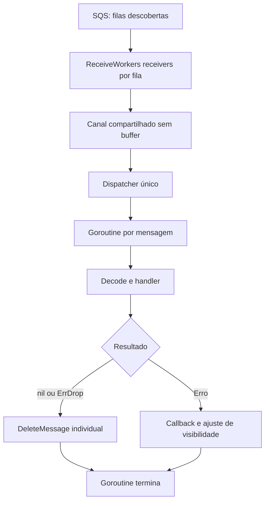

# Proposta: receivers concorrentes com uma goroutine por mensagem

Data: 9 de outubro de 2026.

Status: desenho implementado localmente para revisão. Ganhos de performance
não foram demonstrados por benchmark.

## Objetivo e API

Configurar o paralelismo de recebimento por fila, mantendo processamento
independente para cada mensagem, sem um limite global de handlers ativos.

```go
gosqs.ConsumerOptions{
    QueueName:           "orders",
    ReceiveWorkers:      2,
    MaxNumberOfMessages: 10,
}
```

| Propriedade | Padrão | Contrato |
| --- | --- | --- |
| `ReceiveWorkers` | 1 | Receivers concorrentes por fila descoberta; zero seleciona o padrão e valores negativos são inválidos. |
| `MaxNumberOfMessages` | 10 | Máximo solicitado por receive, entre 1 e 10; zero seleciona o padrão. |

Com três filas e `ReceiveWorkers: 2`, existem seis receivers e um dispatcher.
Cada mensagem aceita ganha sua própria goroutine, sem um pool persistente.

`MaxConcurrency`, sua configuração interna e `DefaultMaxConcurrency` são
removidos. Clientes que utilizam esses símbolos precisam remover as referências
para compilar. Nenhuma das opções restantes limita handlers ativos.

## Arquitetura



Cada receiver executa `ReceiveMessage`, desmembra o lote e envia as mensagens
individualmente ao canal. Inicia outro receive depois de entregar o lote atual.
A entrega interna conserva a mensagem, a fila de origem e o instante anterior
ao receive, usado como referência conservadora do orçamento de visibilidade.

O dispatcher consome o canal, registra o trabalho no `WaitGroup` e inicia uma
nova goroutine por entrega. Cada goroutine executa decode, handler, callbacks
e confirmação ou ajuste de visibilidade. Uma mensagem lenta não impede o
início de outras, inclusive de batches posteriores.

Cada envio ao canal tem um único destinatário. Isso não elimina reentregas do
SQS: o handler deve suportar concorrência e implementar idempotência na
aplicação. Não há garantia FIFO por grupo nem justiça entre filas.

## Controle de fluxo e performance

O canal sem buffer sincroniza a entrega entre receivers e dispatcher. Ele não
controla a quantidade de processamentos simultâneos: ao criar uma goroutine,
o dispatcher pode imediatamente aceitar outra mensagem.

Cada receiver mantém no máximo um lote pendente de handoff, mas o total de
mensagens em processamento, goroutines e memória pode crescer enquanto o
recebimento for mais rápido que os handlers e confirmações. `ReceiveWorkers`
controla chamadas de rede simultâneas, não a carga acumulada nas dependências.

A visibilidade precisa cobrir espera de handoff, handler e confirmação. Mantém-se
a ausência de renovação automática. A biblioteca não executa novamente o handler
localmente após uma falha de confirmação; a entrega pode reaparecer pelo SQS.

Não prometer ganho de throughput apenas pela mudança de arquitetura. Avaliar
1, 2 e 4 receivers por fila com workload e recursos constantes, considerando
handlers rápidos, latência de I/O, durações variáveis e filas com e sem backlog.
Medir mensagens confirmadas por segundo, latência de processamento e confirmação,
espera para iniciar o handler, goroutines, CPU, memória, erros e reentregas.

## Erros e shutdown

Preservar os resultados do handler: `nil` e `ErrDrop` confirmam individualmente;
outros erros são reportados e solicitam ajuste de visibilidade. Falhas de receive
após os retries do SDK interrompem o consumer e iniciam drenagem.

A ordem de shutdown é:

1. Cancelar polling, interrompendo receives e envios bloqueados ao canal.
2. Aguardar todos os receivers saírem.
3. Fechar o canal uma única vez pelo coordenador.
4. Aguardar o dispatcher terminar, garantindo que não haja mais `WaitGroup.Add`.
5. Aguardar as goroutines de mensagens, incluindo callbacks e confirmações.

O contexto de trabalho conserva valores de `Run` e permanece válido durante a
drenagem. Ao atingir `ShutdownTimeout`, cancelar esse contexto e retornar
`ErrShutdownTimeout` junto da causa original. Após esse cancelamento, o dispatcher
não inicia trabalho adicional ao consumir uma entrega restante.

Entregas não aceitas pelo dispatcher não são confirmadas e podem reaparecer após
a expiração. Handoffs em corrida com o cancelamento podem ser aceitos e drenados.
Handlers que ignoram cancelamento podem sobreviver ao retorno de `Run`; manter
`ErrAlreadyRunning` até receivers, dispatcher e goroutines anteriores terminarem.

## Validação

Cobertura exigida:

- Quantidade de receivers por fila, inclusive com descoberta por prefixo.
- Receives solicitando o batch configurado independentemente dos handlers ativos.
- Processamento simultâneo entre mensagens e entre batches, antes de liberar handlers anteriores.
- Uma execução por entrega ao canal, preservando fila, conteúdo e receipt handle.
- Cancelamento de receive e handoff sem destinatário, sem envio em canal fechado.
- Drenagem com contexto válido, timeout, exclusividade de `Run` e reutilização após saída do trabalho anterior.
- Resultados do handler, erros e callbacks.

Executar `go build ./...`, `go test -race ./...` e `go vet ./...`; compilar também
os testes com a tag de integração sem exigir a execução do emulador.
Atualizar README, exemplos e guia de migração junto da mudança.

## Evoluções posteriores

Buffer configurável, confirmação desacoplada com batch delete, renovação de
visibilidade e novos controles de processamento ficam para incrementos separados.
Deduplicação de efeitos de negócio continua sendo responsabilidade da aplicação.

## Referências

- [Artigo que motivou a discussão](https://fidelissauro.dev/sqs-consumer-go/).
- [Go: pipelines e cancelamento](https://go.dev/blog/pipelines).
- [AWS: visibility timeout](https://docs.aws.amazon.com/AWSSimpleQueueService/latest/SQSDeveloperGuide/sqs-visibility-timeout.html).
